# 럭키 넘버 카드 · 데모 v0.1

내 포토카드 멤버와 함께 찍는 프레임. 정품은 기본, 럭키 넘버는 덤.

프로덕션: https://lucky-number-card.vercel.app

## 화면 흐름 (데모 시나리오)

실물 포토카드 안의 NFC 를 폰에 대면 앱 설치·로그인 없이 브라우저가 카드 전용 주소로 열린다. 아래는 폰(390×844) 기준 실제 화면이다. 캡처는 `node scripts/shoot-readme.mjs` 로 다시 만들 수 있다(별도 포트 3100, 임시 저장소를 써서 실제 등록 상태는 건드리지 않음).

### 1. 홈 (데모 입구)

데모에서는 카드를 대는 대신 홈의 카드를 누른다. 관리자 모드가 꺼져 있으면 내 도감에 있는 멤버만 선명하고 나머지는 흐리다. 관리자 모드를 켜면 모든 카드에 멤버·번호 이름판이 뜨고, 럭키 카드에는 금색 점이 붙는다(시연자용 힌트). 하단 탭은 홈 · 내 도감 · 관리.

<table><tr>
<td align="center">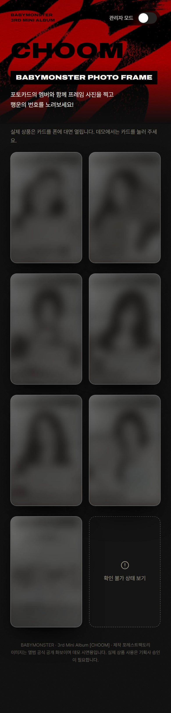<br><sub>관리자 모드 꺼짐 (도감 비어 있음)</sub></td>
<td align="center">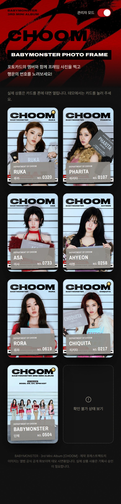<br><sub>관리자 모드 켬 (이름판, 럭키 힌트 점)</sub></td>
<td align="center">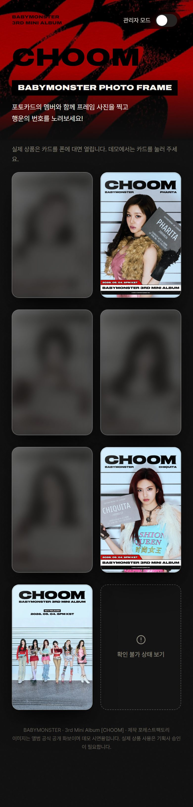<br><sub>카드 3장 등록 후 (보유 멤버만 선명)</sub></td>
</tr></table>

### 2. 카드 홈: 정품 확인과 첫 등록

카드를 태그하면 서버가 토큰을 대조하고 상단 띠에 정품 상태와 번호를 띄운다. 첫 태그한 기기가 그 카드의 등록자가 되고 카드는 내 도감에 자동으로 담긴다. 띠를 누르면 아티스트·앨범·순번·발행일·제작사·누적 확인 횟수가 펼쳐진다.

<table><tr>
<td align="center">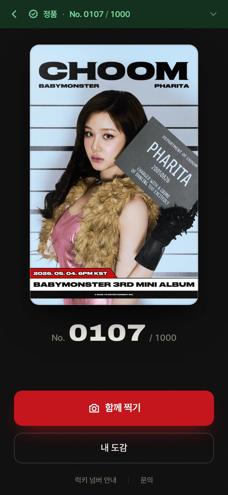<br><sub>정품 · No. 0107 / 1000</sub></td>
<td align="center">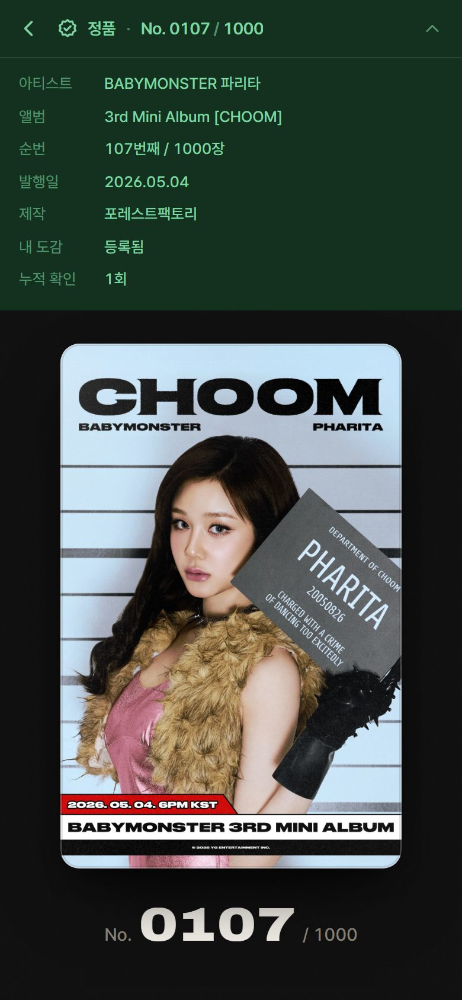<br><sub>정품 띠 펼침 (상세 정보)</sub></td>
</tr></table>

### 3. 럭키 넘버

정품 확인 + 이 기기가 첫 등록자 + 럭키 목록에 있는 번호, 세 조건이 모두 맞을 때만 기본 화면이 뜬 뒤 약 1초 후 금색 LUCKY NUMBER 배지가 미끄러져 들어온다. 배지를 누르면 혜택 안내와 응모 버튼이 나온다(데모는 안내까지). 럭키가 아닌 카드에는 어떤 결과 문구도 없다.

<table><tr>
<td align="center">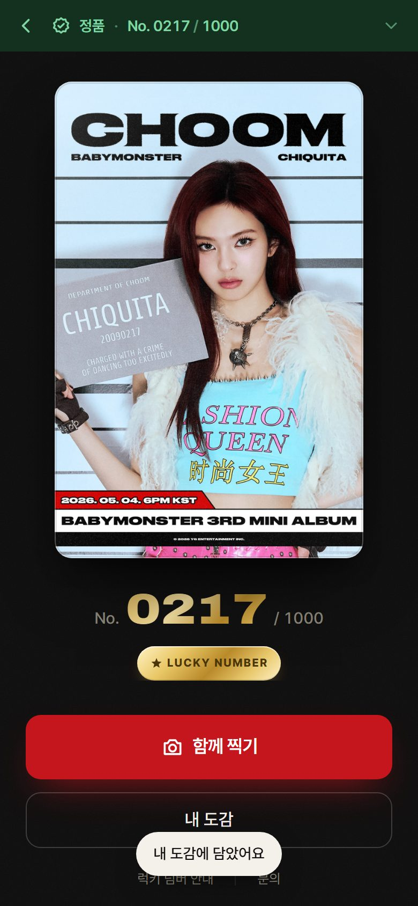<br><sub>첫 등록 + 럭키 카드 (치키타 생일 0217)</sub></td>
<td align="center">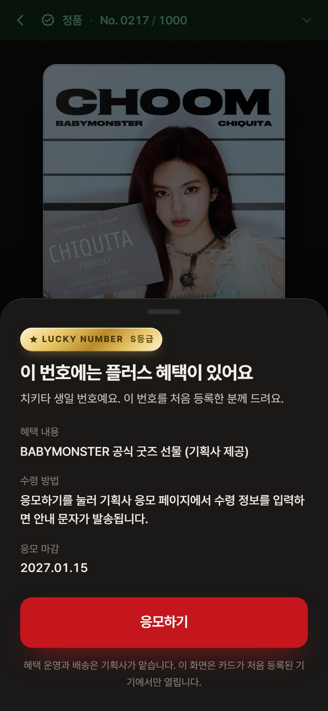<br><sub>배지 탭: 혜택 안내</sub></td>
</tr></table>

### 4. 함께 찍기

내 사진 한 장 옆에 카드 멤버가 선다. 셀카를 찍거나 갤러리에서 고르면 프레임에 합성되고, 멤버 위치(왼쪽·오른쪽)와 프레임을 고른 뒤 저장·공유한다. 럭키 카드는 금색 프레임 1종이 추가로 열린다. 사진은 서버로 보내지 않고 전부 폰 안에서 합성된다.

<table><tr>
<td align="center">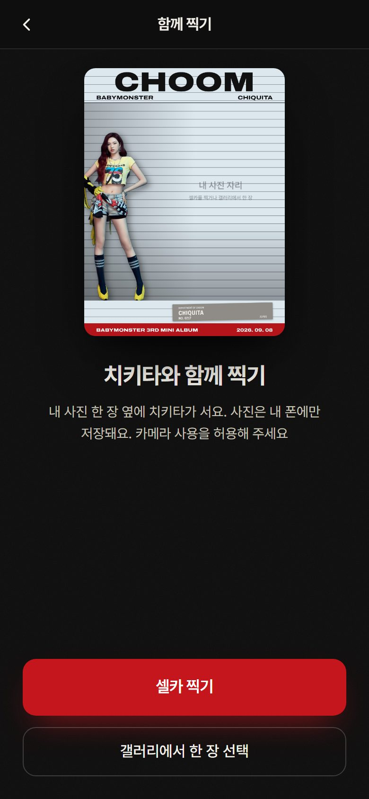<br><sub>시작 화면</sub></td>
<td align="center">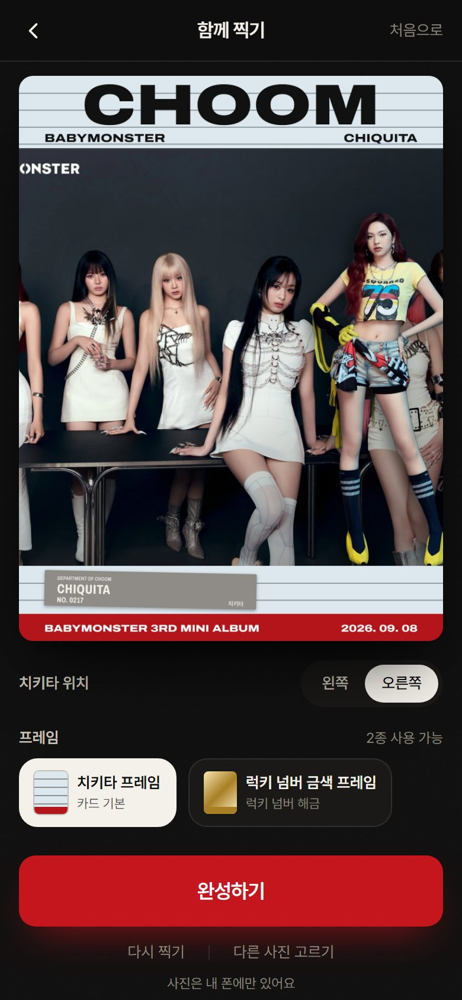<br><sub>사진 넣은 뒤 위치·프레임 선택</sub></td>
<td align="center">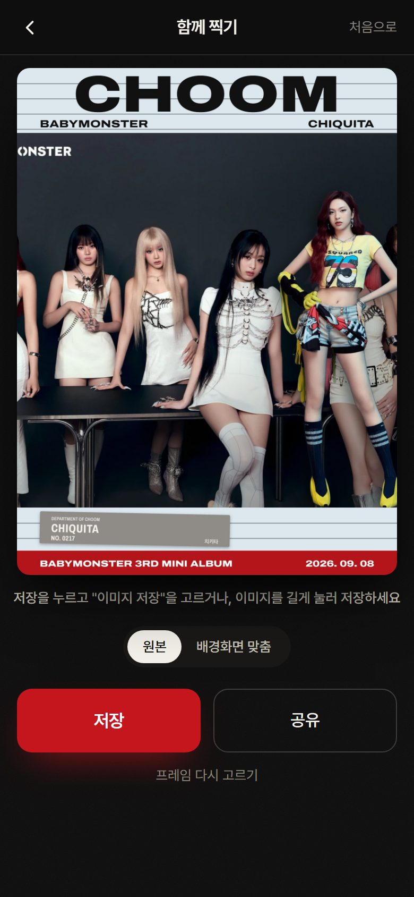<br><sub>완성: 저장·공유, 배경화면 비율</sub></td>
</tr></table>

### 5. 내 도감

이 기기에서 등록한 카드 목록. 브라우저 저장소에만 저장되고 계정은 없다. 미보유 멤버는 흐리게, 럭키 카드는 LUCKY 표시. 세트 완성률이 올라가고, 멤버 6장 + 단체 카드 1장 = 7장을 전부 이 기기 도감에 등록하면 **세트 완성 이벤트**에 응모할 수 있다. 응모자 가운데 일부에게 기획사가 소정의 사은품을 지급한다(선정 방식과 수량은 안내 페이지에 표기). 프레임 해금은 없다.

> 구현 상태: 이벤트 안내 시트와 안내 페이지 항목은 아직 코드에 반영되지 않았다. 현재 데모는 7장 완성 시 예전 기획(단체 프레임 해금) 연출이 남아 있다.

<table><tr>
<td align="center">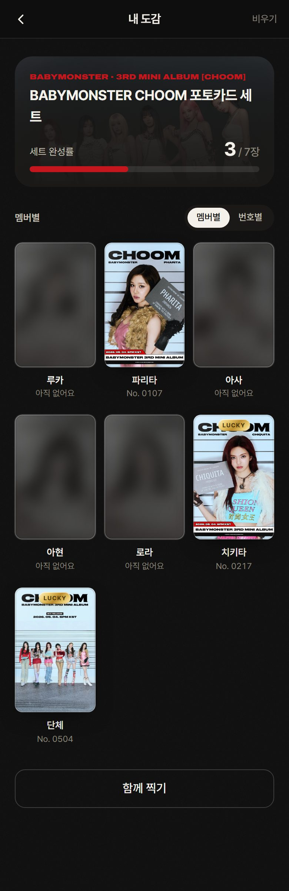<br><sub>3 / 7장 등록 상태</sub></td>
</tr></table>

### 6. 정품 상태 3종

| 상태 | 띠 색 | 동작 |
| --- | --- | --- |
| 정품 확인 | 초록 | 함께 찍기·도감·럭키 확인 모두 열림 |
| 다른 기기 등록 | 노랑 | 정품 사실은 표시. 함께 찍기는 열리고 도감 등록·럭키 확인은 잠김 |
| 확인 불가 | 빨강 | 함께 찍기 잠김. 재시도·문의 버튼. "가품"이라는 단어는 쓰지 않음 |

<table><tr>
<td align="center">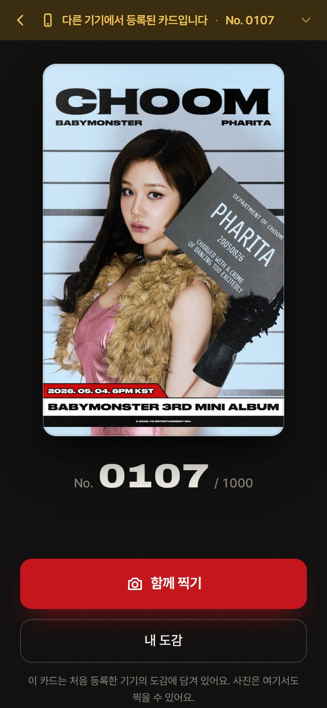<br><sub>다른 기기에서 이미 등록된 카드</sub></td>
<td align="center">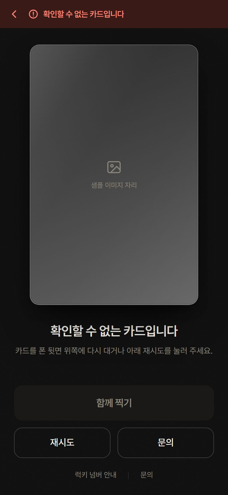<br><sub>확인할 수 없는 카드 (토큰 불일치·미발행)</sub></td>
</tr></table>

### 7. 럭키 넘버 안내와 관리

안내 페이지는 총 발행 수량, 럭키 수량과 비율, 사전 공개한 럭키 목록 해시(SHA-256), 응모 마감, 세트 완성 이벤트의 사은품 수량·선정 방식·마감을 그대로 적는다. 관리 화면은 비밀번호로 들어가며 카드 번호 수정, 등록 상태·확인 횟수 확인, 데모 초기화를 한다. 템플릿 화면은 멤버별 프레임을 검수용으로 나열한다.

<table><tr>
<td align="center">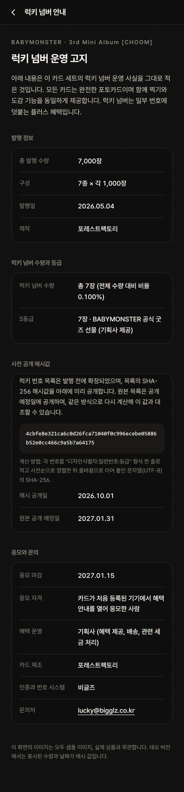<br><sub>럭키 넘버 안내 (법적 고지)</sub></td>
<td align="center">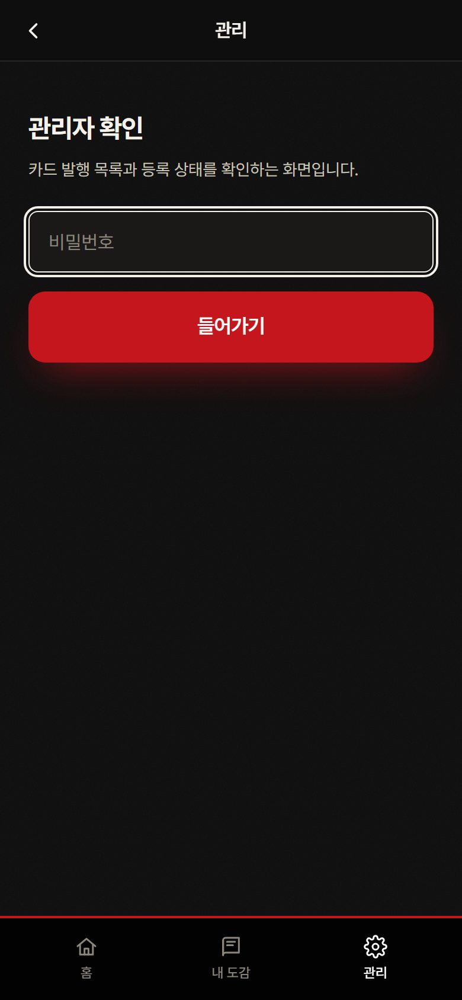<br><sub>관리 로그인</sub></td>
<td align="center">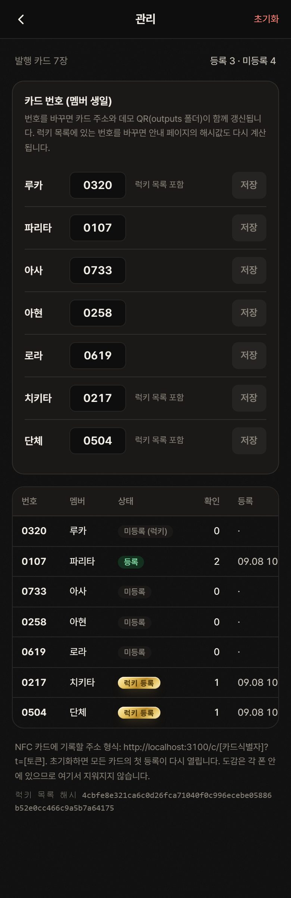<br><sub>관리: 번호 수정, 등록 상태</sub></td>
</tr></table>

<table><tr>
<td align="center">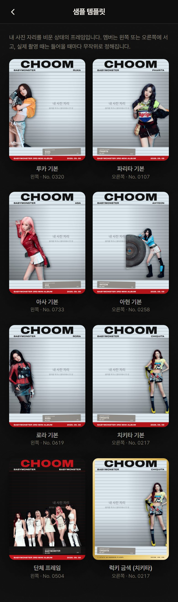<br><sub>샘플 템플릿 검수</sub></td>
</tr></table>

## 실행

```bash
npm install
npm run dev        # http://localhost:3000
npm run dev:https  # https://localhost:3000 (폰에서 카메라를 쓰려면 이쪽)
```

폰에서 같은 와이파이로 보려면 실행 로그에 나오는 Network 주소를 쓴다.
카메라(셀카 찍기)는 브라우저 규칙상 `localhost` 이거나 HTTPS 일 때만 열린다. 폰에서 `192.168.x.x` 주소로 접속할 때는 `npm run dev:https` 로 띄우고, 폰 브라우저의 인증서 경고를 한 번 통과하면 된다. 배포 주소(Vercel)는 자동으로 HTTPS 다.

## 데모 카드 주소 3개

`outputs/demo-urls.txt` 와 `outputs/qr_*.png` 에 저장되어 있다. `npm run qr` 로 다시 만들 수 있다 (`npm run qr -- https://배포주소` 로 배포 주소 기준 재생성).

| 용도 | 주소 |
| --- | --- |
| 정품 일반 | `/c/bm-choom-pharita-0107?t=P3WZ8HN5LC2D` |
| 럭키 | `/c/bm-choom-chiquita-0217?t=C4NQ7YB3ZH9J` |
| 단체 카드 | `/c/bm-choom-group-0504?t=R5XC3BQ9WN7E` |
| 확인 불가 시연 | `/c/bm-choom-unknown-9999?t=ZZZZ0000AAAA` |

첫 화면 `/` 에 위 주소가 모두 버튼으로 있다.

## 화면

- `/c/[카드식별자]?t=[토큰]` 카드 홈 (NFC 카드에 기록하는 주소)
- `/studio` 함께 찍기 (내 사진 한 장 + 멤버 누끼)
- `/templates` 멤버별 샘플 템플릿 검수
- `/collection` 내 도감 (브라우저 저장소)
- `/notice` 럭키 넘버 안내 (법적 고지, 사전 공개 해시)
- `/admin` 관리 (비밀번호: `.env.local` 의 `ADMIN_PASSWORD`)

## 교체 지점

- 정품 검증을 정식(보안 칩 서명 확인)으로 바꿀 때: `lib/verify/index.ts` 한 파일. `verifyCard` 안의 `verifyMock` 호출을 `verifyWithSecureChip` 으로 바꾸고 그 함수를 채운다. 입력·출력 형태는 `lib/verify/types.ts` 에 고정되어 있다.
- 서버 저장: `lib/store/` 안에 파일 백엔드(`file.ts`, 로컬용)와 Upstash Redis 백엔드(`redis.ts`, 배포용)가 있다. `KV_REST_API_URL` 과 `KV_REST_API_TOKEN`(또는 `UPSTASH_REDIS_REST_URL`, `UPSTASH_REDIS_REST_TOKEN`)이 있으면 Redis, 없으면 `data/registrations.json` 파일을 쓴다. 다른 저장소로 바꿀 때는 `lib/store/types.ts` 의 `StoreBackend` 형태에 맞춰 파일 하나를 추가하고 `index.ts` 에서 고르면 된다.
- 이미지: `public/choom/` (CHOOM 공식 공개 화보, 출처 `public/choom/SOURCES.txt`, 재다운로드 `node scripts/fetch-choom.mjs`). 경로는 `data/cards.json` 의 image / cutImage / heroImage / groupImage. 실제 상품 사용은 기획사 승인 필요.
- 카드 목록과 럭키 목록: `data/cards.json`, `data/lucky-numbers.json`. 럭키 목록을 바꾸면 안내 페이지 해시가 자동으로 다시 계산된다.

## 배포 (Vercel)

프로덕션 주소: https://lucky-number-card.vercel.app (프로젝트 `lucky-number-card`, 2026-09-07 첫 배포)

배포 환경은 서버 파일을 쓸 수 없으므로 등록 상태 저장소가 필요하다. Vercel 마켓플레이스의 Upstash Redis 를 붙이면 환경 변수가 자동으로 들어간다.

```bash
npm i -g vercel
vercel login
vercel link                              # 프로젝트 연결 (처음 한 번)
vercel integration add upstash           # Redis 생성. 브라우저 단계가 뜨면 완료 후 계속
vercel env add ADMIN_PASSWORD production # 관리 화면 비밀번호
vercel env pull .env.local --yes         # 로컬에서도 같은 Redis 를 쓰려면
vercel deploy --prod
```

배포 후 `npm run qr -- https://배포주소` 로 QR 을 다시 만들고, 관리 화면(`/admin`)에서 "데모 초기화"를 한 번 눌러 등록 상태를 비운다.
링크 미리보기(카카오톡 등)에 나오는 이미지는 `app/opengraph-image.tsx`, 홈 화면 아이콘은 `app/icon.tsx` 와 `app/apple-icon.tsx` 에서 만든다.

## 점검 스크립트

```bash
npm run typecheck     # 타입 검사
npm run lint          # ESLint
npm test              # 단위 테스트 (검증 3상태, 토큰 대조, 확인 횟수 규칙, 해시)
npm run test:e2e      # 폰 화면 스모크 테스트 21항목 (배포용 빌드 + 3100 포트, 등록 상태는 임시 파일)
node scripts/shoot-readme.mjs   # README 화면 캡처 17장 재생성 (docs/screenshots, 같은 방식으로 격리)
npm run check:words   # 금지 단어, 줄표 전수 검색
npm run qr            # 데모 QR 3장 생성
```

`npm run test:e2e` 는 `next build` 를 먼저 돌린다. 빌드가 이미 있으면 `SKIP_BUILD=1 npm run test:e2e` 로 건너뛴다. 실제 `data/registrations.json` 은 건드리지 않으므로 시연용 폰의 첫 등록 상태가 바뀌지 않는다.

## 확인 규칙 (서버)

- 카드 주소의 토큰(`?t=`)은 `data/cards.json` 에 기록된 그 카드의 값과 정확히 같아야 정품이다. 형식만 맞는 다른 토큰은 확인 불가.
- 같은 기기가 30분 안에 같은 카드를 다시 열면(뒤로가기, 새로고침) 누적 확인 횟수를 올리지 않는다. 다른 기기는 바로 올린다.
- 앱 안에서 카드 홈으로 돌아가는 링크(도감, 함께 찍기의 뒤로가기)는 토큰을 붙여 만든다(`lib/card-link.ts`). 토큰을 모르면 첫 화면으로 보낸다.

## 원칙 (코드에 반영됨)

- 사진은 서버로 보내지 않는다. 촬영·불러오기·합성·저장 전부 브라우저 안에서 끝난다. 서버로 가는 요청은 카드 확인 API 하나뿐이다.
- 럭키가 아닌 카드에는 어떤 결과 문구도 없다.
- 럭키 연출은 정품 확인 + 이 기기가 첫 등록자 + 럭키 카드, 세 조건이 모두 맞을 때 한 번만.
- 세트 완성 이벤트는 같은 기기 도감에 7장(멤버 6 + 단체 1)이 전부 등록됐을 때만 응모 안내가 열린다. 화면 문구에 "추첨, 당첨, 확률" 은 쓰지 않는다. 선정 방식은 안내 페이지에서만 서술.
